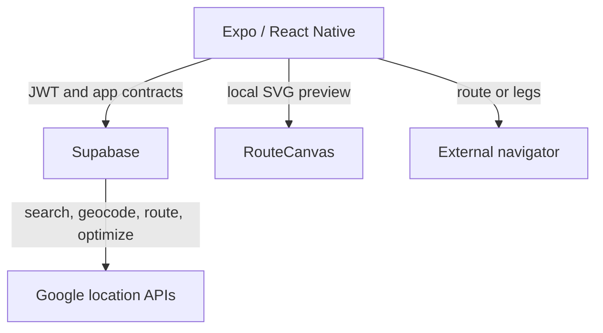
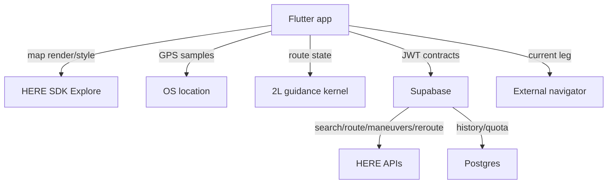

# 2L Maps

**A multi-stop route optimizer for the single mobile professional.**

You have a disordered list of stops and need a usable visiting order in seconds. 2L Maps resolves
the addresses, optimizes the route, saves the confirmed result, and is evolving toward a branded
map with focused in-app guidance.

> **The user pays for the order and for getting through it with less friction—not for a generic
> map feature list.**

---

## Status: implemented system and approved migration

### Current on `main`

The Expo/React Native application, Supabase backend, automated tests, CI-built Android APK, and
product documentation are implemented. Address search, geocoding, routing, and optimization are
currently proxied to Google from Supabase Edge Functions. The route preview is a local synthetic
SVG scene rather than a Google map. Driving currently uses external navigator handoff.

Every push to `main` starts `.github/workflows/android-preview.yml`. Download the
`2l-maps-standalone` artifact from that run and validate the physical Android build against
[`docs/40_UI_IMPLEMENTATION_AUDIT.md`](docs/40_UI_IMPLEMENTATION_AUDIT.md).

### Approved target, not yet implemented

HERE will replace Google for the online map and location services, subject to a permitted-use and
cost gate. The target client is Flutter using **HERE SDK Explore**—not the separately contracted
HERE SDK Navigate. Supabase remains the system of record for authentication, entitlements, quotas,
routes, and History. Google OAuth may remain initially because authentication is independent of
location services.

2L Maps will build a conservative online guidance kernel from operating-system location updates
and HERE Routing API v8 polylines, route handles, and `turnByTurnActions`. The first scope is
position/route progress, current and next maneuver, distance/ETA, visual/TTS prompts, sustained
deviation rerouting, arrival, restoration, and one minimal external-navigation control for the
**current leg only**.

The target does **not** promise offline maps/routing/guidance, HERE Positioning, road-network map
matching, lanes, junction views, speed/road-sign warnings, tunnel extrapolation, or parity with
HERE Navigate.

Before implementation, HERE must confirm that the Base Plan permits the actual 2L use cases. Its
published restrictions identify “Optimization” as excluded except through HERE Tour Planning, so
free Routing transactions cannot be treated as authorization to reorder stops. Exact reported
allowances also remain unverified until an account exposes the applicable price table.

See [`docs/41_HERE_MIGRATION_PROGRAM.md`](docs/41_HERE_MIGRATION_PROGRAM.md) for capabilities,
blockers, risks, cost gates, data design, spike acceptance, and pull-request sequence.

---

## Product boundary

| Current | Approved target |
|---|---|
| Planner for one professional, one vehicle, 5–25 stops | Planner plus essential online guidance |
| Google server APIs behind Supabase | HERE online APIs behind the same server controls, where authorized |
| Local SVG route preview | Branded HERE SDK Explore map |
| External app drives the route | 2L guidance kernel drives; external app can open the current leg |
| Local + Supabase History | Local + Supabase History, provider-neutral |
| Expo/React Native client | Flutter after the Explore/guidance spike |
| No in-app GPS route following | OS location + pure-Dart conservative route following |
| No offline map | Still no offline map; Navigate is not in scope |

Fleet dispatch, multiple vehicles, driver management, and a web dashboard remain out of scope.

---

## Architecture

### Current

### Target

No server-service credential ships in the client. GPS samples are processed locally; they do not
generate one upstream request each. Provider SDK/API types never become persisted product
contracts.

---

## Migration decisions

- [ADR-0030](docs/adr/0030-here-platform-and-navigation-target.md) accepts HERE Explore plus
  app-owned essential guidance, explicitly removing Navigate.
- [ADR-0031](docs/adr/0031-spike-before-flutter-migration.md) requires a seven-day Android+iOS
  guidance-kernel spike before the Flutter rewrite.
- Base Plan eligibility for one-driver stop optimization is a hard gate; HERE Tour Planning is the
  documented exception that must be evaluated.
- Existing Google-era ADRs continue to describe the current implementation until their cutovers.
- Test data may be reset; there is no production-data preservation requirement.
- Android remains first for delivery, while iOS viability is proved during the spike.
- Google OAuth stays initially; it is not a Google location-service dependency.

---

## Documentation

| Document | Purpose |
|---|---|
| [`docs/41_HERE_MIGRATION_PROGRAM.md`](docs/41_HERE_MIGRATION_PROGRAM.md) | Explore/custom-guidance target, eligibility, gates, waves, risks |
| [`docs/INDEX.md`](docs/INDEX.md) | Reading paths and area ownership |
| [`docs/00_PROJECT_OVERVIEW.md`](docs/00_PROJECT_OVERVIEW.md) | Current product and binding glossary |
| [`CLAUDE.md`](CLAUDE.md) | Development constitution |
| [`docs/36_IMPLEMENTATION_PLAN.md`](docs/36_IMPLEMENTATION_PLAN.md) | Implemented work and migration status |
| [`docs/31_COST_MODEL.md`](docs/31_COST_MODEL.md) | Current Google baseline and HERE verification gate |
| [`docs/38_QUICK_START_SETTINGS.md`](docs/38_QUICK_START_SETTINGS.md) | Current setup; HERE onboarding replaces location secrets later |

Documentation that names Google describes the implemented system unless it explicitly says
**Target**. The HERE program controls future changes until each owning document is migrated.

---

## Working in this repository

Read [`CLAUDE.md`](CLAUDE.md) and the document owning the area before writing code.

- Start every new program wave from the latest `main` and use a new pull request.
- Do not combine runtime rewrite, provider cutover, schema reset, and guidance into one merge.
- Do not commit HERE SDK archives, credentials, account pricing, or contracts publicly.
- Keep provider access behind facades and all metered server calls behind Supabase quota.
- A GPS sample never directly triggers a paid request.
- Do not present essential guidance as equivalent to HERE Navigate.
- Keep current-leg external fallback reachable in ambiguous and degraded states.
- Use the current CI standalone APK for Android checks until the Flutter delivery wave replaces it.

---

## Stack

**Current:** React Native · Expo · TypeScript · Expo Router · React Query · Zustand · NativeWind ·
Supabase · Google Places/Geocoding/Routes/Route Optimization server APIs · RevenueCat · Firebase ·
Sentry · GitHub Actions

**Approved target:** Flutter · Dart · HERE SDK Explore · authorized HERE REST APIs · OS location ·
2L guidance kernel · Supabase · RevenueCat · Sentry · GitHub Actions. Exact analytics/crash tooling
is revalidated during the Flutter plan.

---

## Attribution, terms, and cost

The current implementation remains subject to Google Maps Platform terms until Google-derived
location content and services are removed.

The HERE Base Plan may provide substantial free allowances, but allowances and allowed use are
different controls. Before code, the account must confirm:

- the permitted product for stop-order optimization;
- custom guidance from Routing v8 actions and route-handle rerouting;
- storage/retention and map-overlay rights;
- exact map, search, routing, optimization, and rerouting transaction definitions;
- current free caps, overages, RPS limits, and spending controls.

The owner-supplied working figures of 30,000 map/geocoding transactions and approximately 5,000
Routing transactions are not code or subscription assumptions until verified in the account.
