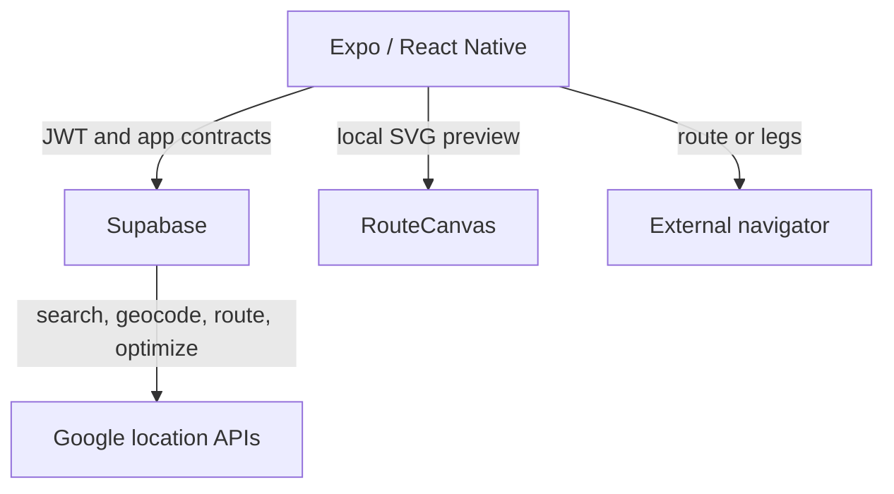
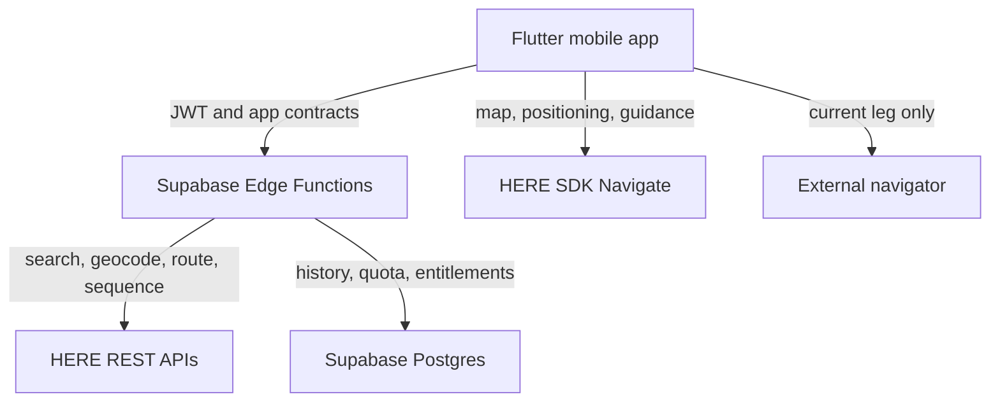

# 2L Maps

**A multi-stop route optimizer for the single mobile professional.**

You have a disordered list of stops and need a usable visiting order in seconds. 2L Maps resolves
the addresses, optimizes the route, saves the confirmed result, and is evolving into a complete
in-app navigation product.

> **The user does not pay for a map. They pay for the order—and for getting through the route
> safely with less friction.**

---

## Status: implemented system and approved migration

### Current on `main`

The Expo/React Native application, Supabase backend, automated tests, CI-built Android APK, and
product documentation are implemented. Address search, geocoding, routing, and optimization are
currently proxied to Google from Supabase Edge Functions. The route preview is a local synthetic
SVG scene rather than a Google map. Driving currently uses external navigator handoff.

Every push to `main` starts `.github/workflows/android-preview.yml`. Download the
`2l-maps-standalone` artifact from that run and validate the physical Android build against
[`docs/40_UI_IMPLEMENTATION_AUDIT.md`](docs/40_UI_IMPLEMENTATION_AUDIT.md).

### Approved target, not yet implemented

HERE will replace Google for location search, geocoding, routing, optimization, map rendering, and
navigation. The target client is Flutter using HERE SDK Navigate after a short measured spike.
Supabase remains the system of record for authentication, entitlements, quotas, routes, and
History. Google OAuth may remain initially because authentication is independent of location
services.

The target experience includes a custom quiet 3D HERE map in the existing 2L colours, complete
in-app guidance, supported offline features, voice, rerouting, lanes and warnings, plus one minimal
external-navigation control for the **current leg only**. The existing confirm/open-navigator
primary flow is removed at cutover, not before.

Implementation is currently gated by the absence of a HERE account, Navigate quote, credentials,
and privately delivered SDK package. See
[`docs/41_HERE_MIGRATION_PROGRAM.md`](docs/41_HERE_MIGRATION_PROGRAM.md) for prerequisites,
risks, cost gates, data design, spike acceptance, and the pull-request sequence.

---

## Product boundary

| Current | Approved target |
|---|---|
| Planner for one professional, one vehicle, 5–25 stops | Planner plus complete in-app navigation |
| Google server APIs behind Supabase | HERE REST APIs behind the same server controls |
| Local SVG route preview | Branded HERE vector/3D map |
| External app drives the route | 2L Maps drives; external app may open the current leg |
| Local + Supabase History | Local + Supabase History, provider-neutral |
| Expo/React Native client | Flutter expected after the Android+iOS spike |

Fleet dispatch, multiple vehicles, driver management, and a web dashboard remain out of scope.

---

## Architecture

### Current

No Google web-service credential ships in the client. Supabase owns authorization, entitlement,
rate limiting, quota, caching, upstream calls, and usage recording.

### Target

Provider SDK types never become persisted product contracts. Locations use internal IDs, while
provider IDs remain replaceable references.

---

## Migration decisions

- [ADR-0030](docs/adr/0030-here-platform-and-navigation-target.md) accepts HERE as the target
  location platform and keeps Supabase as the product backend.
- [ADR-0031](docs/adr/0031-spike-before-flutter-migration.md) requires a five-day spike and records
  Flutter as the expected production runtime.
- Existing Google-era ADRs continue to describe the current implementation until the corresponding
  cutover lands. They are superseded by implementation PRs, not rewritten retroactively.
- Test data may be reset; there is no production-data preservation requirement.
- Android remains first for delivery, while iOS map/navigation viability is an early spike gate.

---

## Documentation

Start with:

| Document | Purpose |
|---|---|
| [`docs/41_HERE_MIGRATION_PROGRAM.md`](docs/41_HERE_MIGRATION_PROGRAM.md) | Approved target, blockers, gates, waves, risks |
| [`docs/INDEX.md`](docs/INDEX.md) | Reading paths and area ownership |
| [`docs/00_PROJECT_OVERVIEW.md`](docs/00_PROJECT_OVERVIEW.md) | Current product and binding glossary |
| [`CLAUDE.md`](CLAUDE.md) | Development constitution |
| [`docs/36_IMPLEMENTATION_PLAN.md`](docs/36_IMPLEMENTATION_PLAN.md) | Implemented work and execution order |
| [`docs/31_COST_MODEL.md`](docs/31_COST_MODEL.md) | Current Google-era cost model; to be replaced after HERE quote |
| [`docs/38_QUICK_START_SETTINGS.md`](docs/38_QUICK_START_SETTINGS.md) | Current setup; HERE onboarding will replace Google location secrets |

Documentation that names Google describes the implemented system unless it explicitly says
**Target**. The HERE program controls future changes until each owning document is migrated.

---

## Working in this repository

Read [`CLAUDE.md`](CLAUDE.md) and the document owning the area before writing code.

- Start every change from the latest `main` and deliver it in a new pull request.
- Do not combine runtime rewrite, provider cutover, schema reset, and navigation into one merge.
- Do not commit HERE SDK binaries, credentials, quotes, or contracts to this public repository.
- Keep all provider access behind facades and all server-metered calls behind Supabase quota.
- Use the CI standalone APK for current Android phone checks.
- A Flutter/HERE build is not an approved release until both physical-device navigation gates pass.

---

## Stack

**Current:** React Native · Expo · TypeScript · Expo Router · React Query · Zustand · NativeWind ·
Supabase · Google Places/Geocoding/Routes/Route Optimization server APIs · RevenueCat · Firebase ·
Sentry · GitHub Actions

**Approved target:** Flutter · Dart · HERE SDK Navigate · HERE REST APIs · Supabase · RevenueCat ·
Sentry · GitHub Actions. Exact analytics/crash tooling is revalidated during the Flutter plan.

---

## Attribution, terms, and cost

The current implementation remains subject to Google Maps Platform terms until Google-derived
location content and services are removed. HERE terms apply only after account onboarding and
cutover.

HERE SDK Navigate is not assumed to be included in the public Base Plan price. A written quote,
usage entitlements, storage rights, offline-map rights, support level, and SDK distribution terms
are hard gates. Subscription prices and free allowances must be recalculated from that quote plus
measured SDK/API usage; the current Google cost model cannot be reused as a HERE forecast.
