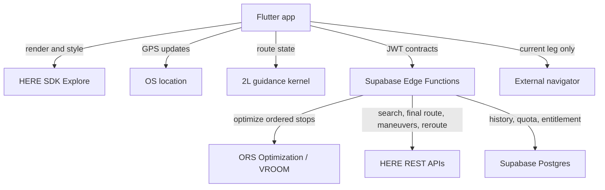

# 41 — HERE Explore + ORS/VROOM Migration Program

> **Status:** Approved target; accounts provisioned; credential rotation and final account checks gated
> **Owner:** Product owner
> **Last reviewed:** 2026-08-20
> **Related:** [ADR-0030](adr/0030-here-platform-and-navigation-target.md) ·
> [ADR-0031](adr/0031-spike-before-flutter-migration.md) ·
> [Implementation Plan](36_IMPLEMENTATION_PLAN.md)

---

## 1. Purpose

This document controls the replacement of Google location services with a disaggregated stack:
OpenRouteService (ORS)/VROOM for stop ordering, HERE SDK Explore and HERE Routing API v8 for map,
final route and maneuver data, plus a deliberately limited 2L guidance engine. It distinguishes the
implemented system from the approved target, names capabilities that are not available without
HERE SDK Navigate, and orders the migration so that pricing headlines never substitute for
contract eligibility or measured usage.

It records that ORS and HERE accounts now exist and that the downloaded Flutter package is
`heresdk-explore-flutter-4.27.2.0.309975.zip`. It does not treat credentials pasted into a chat as
safe operational credentials: affected HERE and ORS keys must be revoked and replaced before use.
It also does not claim that ordered-via billing, retention, or every allowance has been measured. It does not redefine every current screen,
schema, or API payload; those owning documents change in later pull requests after their gates pass.

### Status vocabulary

- **Current** means present on `main` and expected to work today.
- **Target** means approved but not yet implemented.
- **Gate** means evidence required before the next irreversible step.
- **Cutover** means HERE serves production traffic and the corresponding Google dependency can be
  removed.
- **Essential guidance** means the bounded feature set in §2, not HERE Navigate parity.

## 2. Goals

1. Remove Google as the provider of address search, geocoding, route calculation, stop ordering,
   and map rendering; use ORS/VROOM for stop ordering and HERE for the remaining approved surfaces.
2. Use HERE SDK Explore for a branded online map on Android and iOS through Flutter.
3. Build an app-owned, online guidance engine from operating-system location updates and HERE
   Routing API v8 route/maneuver data.
4. Keep a minimal external-navigation control for the **current leg only** throughout guidance.
5. Preserve Supabase as the system of record for authentication, entitlements, quotas, routes,
   favourites, and History.
6. Replace provider-owned identifiers in domain tables with internal UUIDs.
7. Make ORS quota/terms, HERE permitted use/transactions, safety, degraded states, and rollback
   measurable before migration.
8. Use disposable test data to reset the Google-shaped schema instead of building a production
   data migration.

### Essential guidance scope

The first production scope is:

- online position puck and bearing;
- follow/overview camera;
- active route and route-progress rendering;
- current and next maneuver;
- distance to maneuver, remaining distance, and ETA;
- staged visual and TTS maneuver announcements;
- conservative route projection with confidence state;
- sustained off-route detection and bounded rerouting;
- arrival detection and next-leg transition;
- pause/resume and version-safe session restoration;
- current-leg external navigator fallback.

**Non-goals**

- HERE SDK Navigate or any Navigate commercial agreement.
- Downloadable offline maps, offline search, offline routing, or offline guidance.
- HERE Positioning, HERE map matching, lane assistance, junction views, speed-limit warnings,
  road-sign warnings, tunnel extrapolation, spatial audio, or live truck warners.
- Calling this engine equivalent to a mature satellite navigator.
- Storing user History in HERE.
- Committing the proprietary Explore SDK package, a real `.env`, or credential values to this
  public repository.
- Hard-coding the reported 30,000/5,000 allowances before they are verified in the account and
  applicable pricing documents.
- Fleet dispatch, multiple vehicles, or a web control centre.

## 3. Responsibilities

| Concern | Owner | Notes |
|---|---|---|
| Account, Base Plan acceptance, payment controls | Product owner | Required to obtain credentials/package and verify exact allowance |
| ORS optimization eligibility and quota | Product owner + engineering | Public Standard-plan terms/dashboard; 5–25 stops remain below the published 50-route/3-vehicle request-size limits |
| HERE permitted-use eligibility | Product owner + legal/commercial confirmation | HERE receives an already ordered route; no HERE matrix, sequence, or optimization service |
| Flutter/Explore integration | Engineering | Map renderer only; no Navigate APIs |
| Guidance kernel | Engineering | Pure Dart state machine and geometry, replay-tested |
| Location source | Android/iOS through a Flutter plugin | Must support foreground/background policy explicitly |
| Search/routing adapters | Supabase Edge Functions | Metered calls retain authorization, quota, caching, and usage events |
| History and entitlements | Supabase | Remains authoritative and provider-neutral |
| SDK package delivery | Engineering + product owner | Private artifact channel; never the public repository |
| Safety acceptance | Product owner + engineering | Simulation plus controlled physical-road testing |
| Visual acceptance | Product owner | Existing 2L colours plus approved navigation reference |

## 4. Target architecture

Boundary rules:

- The guidance kernel consumes provider-neutral `RoutePlan`, `RouteLeg`, `Maneuver`,
  `RouteHandle`, and `LocationSample` models; it imports no HERE SDK type.
- The Explore SDK is responsible for online map rendering, camera, style, markers, and polylines.
- Operating-system location is the source of device position because HERE Positioning is
  Navigate-only.
- ORS optimization and HERE REST search/geocoding/routing calls are server-mediated so
  credentials, entitlement, provider quotas, caching, cost, and circuit breakers remain
  enforceable. The HERE SDK itself is initialized in Flutter with Explore access-key credentials
  injected at build time; they are never committed to the public repository.
- No HERE Matrix Routing, Waypoints Sequence, Tour Planning, or other HERE optimization endpoint is
  called. ORS returns only the stop order used as ordered vias in one final HERE Routing request.
- ORS/VROOM is a heuristic VRP solver. The product promises a best-found optimized sequence, never
  a mathematically proven global optimum.
- The ORS order uses ORS/OSM travel costs, not HERE live traffic. HERE applies current traffic to
  the final route and ETA; it does not retroactively make the ORS stop order traffic-optimal.
- GPS updates never cause upstream calls one-for-one. Projection and progress are local; a HERE
  request occurs on plan, explicit recalculation, or sustained deviation only.
- A route saved to History is an immutable provider-neutral snapshot and remains readable without
  a HERE call.

## 4.1 Operational configuration approved for the spike

| Item | Approved value or rule |
|---|---|
| HERE SDK | Explore Flutter `4.27.2.0.309975`, private artifact only |
| HERE SDK auth | `HERE_SDK_ACCESS_KEY_ID` + `HERE_SDK_ACCESS_KEY_SECRET`, build-injected into Flutter initialization |
| HERE REST auth | `HERE_REST_API_KEY`, Supabase/server only |
| ORS auth | `ORS_API_KEY`, Supabase/server only |
| ORS endpoint | `https://api.heigit.org/vroom/v0` |
| ORS account limit | 500 Optimization requests per rolling account day, plus measured minute limit |
| Package identity | desired `com.twol.maps`; migration impact must be proved before replacing current `com.doppiaelle.twolmaps` |
| SDK archive | checksum-pinned private CI input; never committed |
| Local configuration | ignored local `.env` is allowed; committed real `.env` is forbidden |

The APP ID is an identifier, not an authentication secret. All access keys/secrets and API keys
shared outside the approved secret channel are treated as compromised and rotated. HERE SDK
credentials are necessarily consumed by the client runtime, but public source control still must
not become their distribution mechanism. ORS and HERE REST keys never enter the mobile bundle.

### Mint Clay 3D visual contract

The reference image defines composition and depth, while the existing 2L tokens remain the source
of brand truth. The spike must prove all of the following on representative dense-city and
low-detail areas, in both light and dark mode:

- perspective-follow camera with approximately 45° pitch during guidance and a predictable
  overview transition;
- visible 3D building volumes where HERE coverage supports them—never synthetic promise of
  buildings everywhere;
- clay-like light palette: warm white/light-neutral terrain, slightly separated roads and
  desaturated building volumes;
- clay-like dark palette: charcoal terrain/buildings with enough road hierarchy and label
  contrast for driving;
- primary route, traveled-route progress, current-position puck and translucent accuracy halo
  derived from the confirmed mint accent tokens; candidates `#00F5D4` and `#2EC4B6` are
  contrast-tested rather than both hard-coded;
- custom stop markers with active/visited/unvisited states and accessible shape differences;
- reduced generic POI density and labels, while retaining safety-critical road names, maneuver
  context, attribution, traffic meaning and legal notices;
- bottom guidance surface, maneuver pill, ETA/distance and minimal current-leg external button
  placed in Flutter UI above the map rather than baked into map styling;
- no essential information communicated by mint color alone;
- screenshots and contrast measurements for daylight, dark mode, route overlap, urban canyon,
  roundabout, reroute and degraded GPS states.

Use HERE Style Editor output only in a format supported by SDK 4.27.2 and validate it on both
platforms. A JSON/YAML filename is not assumed until the downloaded package documentation and
Style Editor export identify the supported artifact.

### Retention implementation contract

Provider-derived HERE search/geocoding coordinates, provider IDs and raw payload fragments receive
`provider = 'here'`, `provider_fetched_at`, and `provider_expires_at = fetched_at + 30 days`.
The purge job nulls or deletes those fields after expiry and is idempotent, observable and tested.
User-authored route name, textual address as entered/confirmed, notes, stop membership and internal
UUIDs remain durable. Reopening a route with expired coordinates enters a visible “refreshing
locations” state and re-geocodes before ORS optimization; it never silently navigates stale
coordinates. Final route polylines, maneuver arrays and route handles are treated as ephemeral
navigation-session data unless written retention rights explicitly allow longer storage.

## 5. Flows

### 5.1 Commercial and account validation

**Trigger:** this plan is accepted.  
**Preconditions:** none.

1. Confirm the provisioned HERE Base Plan account and rotate the credentials exposed during setup.
2. Confirm Android and iOS application registration. Treat the requested `com.twol.maps` identifier as an explicit migration from the implemented `com.doppiaelle.twolmaps`; verify Google OAuth, deep links, signing and store identity before changing it.
3. Use the downloaded Explore Flutter package `4.27.2.0.309975`; verify its checksum and license locally, extract its TAR plugin, and deliver it privately to CI.
4. Confirm access to HERE Style Editor.
5. Read the account-specific pricing, RPS limits, transaction definitions, and restrictions.
6. Obtain written confirmation for the actual use cases:
   - final routing of an externally ordered 5–25-stop sequence;
   - confirmation that sending ordered vias is ordinary routing and not HERE Optimization;
   - route polylines and `turnByTurnActions` used by app-owned visual/TTS guidance;
   - route-handle rerouting during a live trip;
   - retention of search, coordinate, route, and maneuver data;
   - display of custom or independently computed overlays on the HERE map, if needed.
7. Record the exact HERE allowance/overage for map rendering, search/geocoding, final Routing and
   rerouting; record the ORS `/optimization` daily/minute quota shown by the actual account.
8. Configure a hard spending ceiling/kill switch where the account permits it.
9. Put the pinned Explore archive in an approved private artifact channel.
10. Initialize HERE SDK 4.27.2 programmatically with `SdkContext.init`,
    `AuthenticationMode.withKeySecret`, and `SDKNativeEngine.makeSharedInstance`; do not put
    credentials in AndroidManifest.xml or Info.plist. Verify credentials with a real feature
    engine because initialization alone can succeed with invalid credentials.
11. Pin the documented compatibility floor for this SDK: Flutter 3.41.9/Dart 3.11.5,
    Android compile/target SDK 36, min SDK 24, iOS 15.2, and a tested Gradle/AGP/JDK combination.
12. Call ORS Optimization server-side at `https://api.heigit.org/vroom/v0`; do not retain the
    deprecated `api.openrouteservice.org/optimization` host.

**Success:** Gate A is green and engineering knows both what is allowed and what each event bills.  
**Failure:** stop before provider/runtime rewrite. Free quota without permitted use is not a pass.

### 5.2 Hybrid optimization validation

**Trigger:** ORS and HERE test credentials exist; both terms/quota gates are recorded.

1. Send one vehicle plus 5–25 jobs to the server-side ORS `/optimization` adapter.
2. Model fixed start and optional fixed return explicitly; reject unassigned jobs.
3. Extract job IDs from the returned route steps and validate that every requested stop appears
   exactly once.
4. Send that ordered sequence as vias in one HERE Routing API v8 request.
5. Request the supported response fields for polyline, `turnByTurnActions`, summaries and route
   handle; use time-aware routing defaults unless contract tests require an explicit departure.
6. Compare ORS order quality and final HERE ETA against fixtures and small exact benchmarks.
7. Measure the ORS optimization quota headers/dashboard and HERE billed transactions.
8. Exercise circuit breakers, timeouts, invalid/unassigned jobs, 403/429, and provider outage.

**Success:** the hybrid path is permitted, quota-bounded and meets a declared quality threshold.
It is not required to prove the mathematical optimum or live-traffic-optimal stop ordering.

### 5.3 Guidance-kernel spike

**Trigger:** Gate A passes.  
**Timebox:** seven engineering days.

1. Build a disposable Flutter shell with HERE SDK Explore on Android and iOS.
2. Load the first custom 2L style and render a fixture route.
3. Parse provider-neutral maneuvers derived from HERE `turnByTurnActions`.
4. Replay location traces for ideal and adversarial scenarios.
5. Implement projection, progress, maneuver scheduling, confidence, deviation, reroute, arrival,
   restoration, and current-leg fallback.
6. Prove Android/iOS foreground and background transitions.
7. Measure correctness, API transactions, battery, CPU, memory, cold start, map first frame, and
   binary size.
8. Set the feature decision in ADR-0031 from the evidence.

**Success:** Flutter + Explore + essential guidance proceeds to production slices.  
**Failure:** reduce in-app guidance or retain external driving. Do not imitate missing Navigate
capabilities until the demo appears green.

### 5.4 Provider and runtime cutover

1. Introduce provider-neutral domain contracts and schema.
2. Reset the test Supabase project.
3. Add separate ORS optimization and HERE search/routing adapters behind provider-neutral facades.
4. Run contract, quota, billing, and retention tests against controlled non-production calls.
5. Build Flutter vertical slices: auth → route draft → search → optimize → map → History.
6. Promote the replay-tested guidance kernel as a separately reviewed slice.
7. Shadow-compare HERE results with the current provider on test routes without mixing
   provider-derived content in a user-visible production surface.
8. Run controlled physical-road guidance tests on Android, then iOS.
9. Cut test traffic to HERE behind independent map, API, optimization, and guidance flags.
10. Remove Google location secrets, functions, code, workflow inputs, and stale documentation only
    after rollback criteria remain green for one release candidate.
11. Keep Google OAuth until a separate authentication decision replaces it.

## 6. Architectural decisions

| ID | Decision | Applies to |
|---|---|---|
| [ADR-0030](adr/0030-here-platform-and-navigation-target.md) | Explore map + app-owned essential guidance; no Navigate | Map, route data, guidance, History |
| [ADR-0031](adr/0031-spike-before-flutter-migration.md) | Replay-tested guidance spike precedes Flutter rewrite | Mobile runtime and safety |
| [ADR-0006](adr/0006-mandatory-backend-proxy.md) | Server-metered provider calls remain proxied | HERE REST adapters |
| [ADR-0011](adr/0011-server-side-quota-enforcement.md) | Entitlement and quota stay server-owned | All upstream use |
| [ADR-0014](adr/0014-android-first-verification.md) | Android remains first, but iOS is an early spike gate | Device verification |

ADR-0004, ADR-0005, ADR-0007, ADR-0012, ADR-0021, ADR-0026, ADR-0027, and ADR-0028 describe the
current Google-era implementation. They are not rewritten retroactively. Later implementation PRs
mark them superseded where the new system actually replaces their decisions.

## 7. Edge cases

| # | Condition | Expected behaviour | Specified in |
|---|---|---|---|
| 1 | HERE treats ordered-via final routing as excluded Optimization | Stop HERE integration and obtain written authorization or change routing provider | §5.1 |
| 1a | ORS public optimization quota/terms do not support the product | Stop public ORS use; evaluate self-hosted VROOM/ORS or another authorized optimizer | §5.2 |
| 2 | GPS matches two nearby/parallel route segments | Enter ambiguous state; do not advance or speak a maneuver until confidence recovers | guidance spike |
| 3 | GPS jumps briefly off route | Hysteresis absorbs it; no reroute request | guidance spike |
| 4 | Sustained deviation | One bounded reroute; cooldown prevents loops; external fallback remains | guidance spike |
| 5 | No network during a trip | Continue only with the already loaded route/maneuvers while map cache permits; show online degradation and no promise of reroute | guidance UX |
| 6 | App is killed mid-leg | Restore only the same route/leg/version; otherwise require safe recalculation | navigation state |
| 7 | Voice/TTS unavailable | Visual and haptic guidance continue with a visible voice state | guidance UX |
| 8 | Provider identifier changes | Internal location UUID remains stable; refresh provider reference | database PR |
| 9 | HERE quota/spend ceiling reached | Stop new upstream work, preserve saved routes, expose current-leg external fallback | backend PR |
| 10 | Test schema conflicts with target | Reset it; do not preserve disposable provider-shaped rows | database PR |
| 11 | Google OAuth remains enabled | Treat it as authentication only | ADR-0030 |
| 12 | Driver enters a tunnel or poor-GPS area | Freeze uncertain progress and communicate degraded guidance; never invent tunnel movement | guidance UX |

## 8. Error handling

| Failure | Detection | User-facing result | Retry | Fallback |
|---|---|---|---|---|
| HERE credential rejected | typed adapter error + health check | Service configuration unavailable | no blind retry | feature flag off |
| Optimization use/product not authorized | Gate A review | HERE migration unavailable | none | retain current app/evaluate approved provider |
| Search/routing quota exhausted | server quota decision | Explain limit and next action | at reset/entitlement change | saved data/current-leg external app |
| Explore SDK initialization fails | Flutter boundary error | Map unavailable; route list remains readable | one bounded restart | list + external current leg |
| Position confidence low | projection score and consistency | “GPS uncertain”; suppress maneuver advancement | continuous local recovery | external current leg |
| Sustained route deviation | distance + duration + heading gate | Rerouting state | one request + cooldown | remain degraded/external current leg |
| Reroute fails | typed server error | Guidance degraded, safe next action | bounded backoff only when stationary/allowed | external current leg |
| History sync fails | durable local outbox | Saved locally, sync pending | exponential backoff | local History |
| Voice unavailable | TTS capability/error | Voice off, visual guidance active | on capability change | visual/haptic |
| Route version mismatch | restoration validation | Cannot safely resume old guidance | explicit recalc | History snapshot/external leg |

## 9. Best practices

1. Model route following as a deterministic state machine over timestamped location samples; UI
   does not own navigation decisions.
2. Project locally onto a spatially indexed route polyline and track along-route distance rather
   than using straight-line distance to the next maneuver.
3. Require spatial, temporal, and heading evidence before progress/deviation changes; one GPS
   sample decides nothing.
4. Keep API calls event-driven and bounded. GPS frequency must not determine COGS.
5. Version every route, leg, maneuver list, and session. Stale geometry never resumes silently.
6. Keep the external current-leg button reachable in every degraded state.
7. Test recorded traces before road tests, then retain anonymized synthetic/consented fixtures
   rather than raw customer traces.
8. Treat the custom style as a legibility system: road hierarchy, maneuver contrast, labels,
   traffic, warnings, and dark mode outrank decorative similarity.
9. Pin the Explore SDK version and archive its notices, checksum, source, and license metadata in
   the private delivery channel.
10. Do not infer allowed use from technical capability or a free transaction count.
11. Never describe VROOM output as exact. Store solver/provider/version and objective value so
    quality regressions are measurable.
12. Keep ORS and HERE circuit breakers independent; one provider's outage must not create retry
    traffic against the other.

## 10. Checklist and go/no-go gates

### Gate A — account, permitted use, and cost

- [ ] HERE Base Plan account created.
- [ ] Android and iOS applications registered.
- [ ] Explore credentials and Flutter package obtained.
- [ ] Private package delivery method documented.
- [ ] HERE confirms final routing of an externally ordered sequence is permitted without a HERE
      optimization product.
- [ ] ORS Standard-plan commercial/product use and `/optimization` quota confirmed in the account.
- [ ] Custom visual/TTS guidance from Routing v8 actions confirmed as permitted.
- [ ] Retention and map-overlay rights documented.
- [ ] Exact HERE transaction definitions/free allowances and ORS daily/minute limits recorded.
- [ ] Worst-case spend bounded with server quotas and a provider/account kill switch.
- [ ] The owner-supplied 30,000 map/geocode and approximately 5,000 routing figures either
      verified or replaced; they are not embedded as code constants before this box is checked.

### Gate B — hybrid optimization and guidance spike

- [ ] Exact Flutter and Explore versions pinned.
- [ ] Android and iOS map first frame proven.
- [ ] Custom style loads and remains legible in light/dark.
- [ ] ORS request/response contract proven for one vehicle, fixed start, optional return and 5–25 jobs.
- [ ] ORS output validated for duplicates, omissions and unassigned jobs.
- [ ] Hybrid quality benchmark and latency budget recorded; no claim of exact optimum.
- [ ] HERE final-route request proven to use the ORS order without any HERE matrix/sequence call.
- [ ] Route/maneuver contract proven from real HERE fixture responses.
- [ ] Ideal and adversarial trace corpus committed without personal data.
- [ ] Projection, progress, maneuver timing, ambiguity, deviation, reroute, arrival, and restoration
      thresholds declared before evaluation.
- [ ] Voice, background transitions, and current-leg handoff proven on both platforms.
- [ ] False/late/missed maneuver and reroute-loop results recorded.
- [ ] Binary size, start time, map frame, CPU, memory, battery, and transaction usage recorded.
- [ ] No passing feature depends on a Navigate-exclusive API.

### Gate C — data/backend

- [ ] Provider-neutral schema approved.
- [ ] Test-data reset approved and rehearsed.
- [ ] HERE server adapters pass contract, quota, retention, and billing tests.
- [ ] Approved optimization adapter passes cost and quality tests.
- [ ] History is readable without a provider call.

### Gate D — release

- [ ] Android controlled physical-road acceptance complete.
- [ ] iOS controlled physical-road acceptance complete.
- [ ] Poor GPS, parallel roads, roundabouts, missed turns, background, voice loss, and no-network
      states tested.
- [ ] Safety wording accurately calls the feature essential guidance.
- [ ] Cost alarms and kill switches tested.
- [ ] Rollback rehearsal complete.
- [ ] Google location dependencies enumerated at zero.

## 11. Roadmap

| Wave | Scope | Exit condition |
|---|---|---|
| 0 | Documentation and decision pivot | Explore/custom-guidance plan accepted |
| 1 | HERE + ORS accounts, permitted use, quotas, private Explore delivery | Gate A |
| 2 | ORS/VROOM → HERE final route + Flutter guidance-kernel spike | Gate B |
| 3 | Neutral schema/contracts and disposable DB reset | Gate C data portion |
| 4 | ORS optimization plus HERE search/geocoding/final-routing adapters | Contract, quota, legal, and cost tests |
| 5 | Flutter shell, auth, route planning, History | Current planner parity |
| 6 | Branded HERE map and visual system | Design/device acceptance |
| 7 | Essential in-app guidance | Replay and controlled-road matrix |
| 8 | Android then iOS release candidates | Gate D |
| 9 | Google location removal and documentation consolidation | One stable HERE release candidate |

Each wave continues on a new pull request from latest `main` after this documentation PR merges.
Provider, schema, runtime, and guidance changes are not combined into one merge.

## 12. Decision log

| Date | Change | Reason | Author |
|---|---|---|---|
| 2026-08-18 | HERE approved for APIs and map | Product requires a branded map and Google location exit | Product owner |
| 2026-08-18 | Navigate removed; Explore + owned essential guidance approved | Navigate is a separately contracted product; focused guidance should avoid that dependency | Product owner |
| 2026-08-18 | Flutter retained; spike redirected to guidance kernel | HERE supports Flutter Explore and the principal risk is now route following under imperfect GPS | Product owner |
| 2026-08-18 | Base Plan optimization eligibility made a hard gate | Base Plan restrictions identify Optimization as excluded except through Tour Planning | Architecture |
| 2026-08-18 | Supabase retained; test data may be reset | History, auth, quota, and entitlement remain product concerns | Product owner |
| 2026-08-18 | Google OAuth retained initially | Location and authentication migrations are independent risks | Product owner |
| 2026-08-20 | Optimization moved from HERE to ORS/VROOM | HERE Base Plan excludes the use case; disaggregation keeps HERE on map/final-routing surfaces | Product owner |
| 2026-08-20 | Exact/traffic-optimal claims rejected | VROOM is heuristic and ORS ordering does not consume HERE live traffic | Architecture |

## 13. Rationale

Explore provides the part the product cannot reasonably recreate: a performant, customizable HERE
map on both platforms. Routing v8 provides geometry, turn-by-turn actions, road names, route
handles, and a documented rerouting flow. The focused product can own the UI and a conservative
route-progress state machine without paying for or claiming the full Navigate feature set.

That ownership is valuable only if the scope stays honest. Explore does not provide positioning,
road-network map matching, navigation events, warners, or offline maps. Essential guidance must
therefore prefer “uncertain—use fallback” over a confident wrong maneuver. The small external
current-leg control is a safety valve, not an embarrassing remnant.

The visual reference remains feasible as a direction: quiet light/desaturated 3D map, existing 2L
route colours, high-contrast active route, floating next-maneuver card, bottom distance/time
metrics, clear position marker, and minimal current-leg handoff. HERE Style Editor, camera control,
extruded buildings where available, and custom map items provide the mechanisms. License, available
Explore layers, legibility, and device performance define the final result.

The economic premise is narrower but still must be measured. ORS removes HERE Matrix and
Optimization consumption, while the final ordered route should require one HERE request at the HTTP
level. Billing units, time-aware routing charges, public ORS quota and production eligibility are
still account facts, not architecture assumptions. ORS orders against its own OSM-based travel-cost
model; HERE live traffic improves the final geometry and ETA but does not make the order live-
traffic-optimal.

## 14. Rejected alternatives

| Alternative | Attraction | Why rejected |
|---|---|---|
| HERE SDK Navigate | Complete supported guidance and offline | Separate commercial agreement/price; explicitly removed |
| Explore map with no in-app guidance | Lowest risk | Does not meet the approved focused experience |
| Full homemade Navigate parity | Maximum feature ownership | Unsafe and infeasible without map matching, attributes, offline stack, and mature warners |
| HERE calls directly from the client | Simple demo | Breaks quota, entitlement, cost control, and server kill switches |
| Assume 30k/5k allowances settle cost | Fast pricing decision | Exact figures and permitted use must be verified in the account |
| Use any HERE matrix/sequence/optimization endpoint | One provider and live traffic | Base Plan restricts Optimization; the hybrid design removes the use case from HERE |
| Call ORS output “exact” or “HERE live-traffic optimized” | Stronger promise | VROOM is heuristic and HERE is called only after ordering |
| Replace Supabase | Fewer vendors in name | HERE does not replace auth, History, entitlement, or relational state |
| Preserve current test records | Avoid reset | Adds migration complexity for data with no business value |
| Remove Google OAuth in the same cutover | Complete vendor removal | Expands account/recovery risk without helping location migration |

---

## Official evidence checked 2026-08-18

- [HERE SDK Flutter license comparison](https://docs.here.com/here-sdk/docs/flutter-introduction-editions)
- [HERE SDK Explore maps](https://docs.here.com/here-sdk/docs/flutter-maps)
- [HERE SDK map styling examples](https://docs.here.com/here-sdk/docs/flutter-examples)
- [HERE Routing API v8 turn-by-turn guidance data](https://docs.here.com/routing/docs/routing-v8-guidance)
- [HERE Routing API v8 route-handle rerouting](https://docs.here.com/routing/docs/routing-v8-adjust-route-after-deviation)
- [HERE Base Plan pricing entry point](https://www.here.com/get-started/pricing)
- [HERE Base Plan usage restrictions](https://www.here.com/get-started/pricing/base-plan-restrictions)
- [HERE excluded-use-case definitions](https://www.here.com/get-started/pricing/rps-limits-excluded-use-cases)
- [ORS public API restrictions](https://openrouteservice.org/restrictions/)
- [ORS optimization service](https://openrouteservice.org/services/)
- [VROOM project](https://github.com/VROOM-Project/vroom)

The public dynamic pricing page did not expose account-specific numeric rows to this review. The
reported 30,000 map/geocoding and approximately 5,000 routing allowances remain hypotheses until
the HERE account shows the applicable current values.
