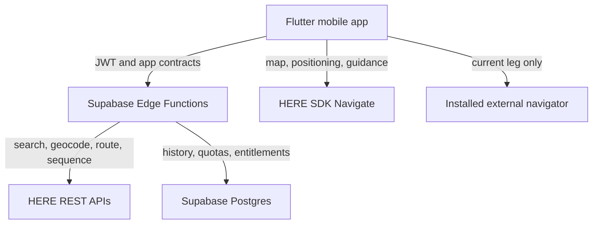

# 41 — HERE Migration Program

> **Status:** Approved target; implementation gated
> **Owner:** Product owner
> **Last reviewed:** 2026-08-18
> **Related:** [ADR-0030](adr/0030-here-platform-and-navigation-target.md) ·
> [ADR-0031](adr/0031-spike-before-flutter-migration.md) ·
> [Implementation Plan](36_IMPLEMENTATION_PLAN.md)

---

## 1. Purpose

This document is the controlling plan for replacing Google location services with HERE and for
turning 2L Maps from a planner with external handoff into a planner with complete in-app
navigation. It distinguishes the implemented system from the approved target, defines commercial
and technical gates, and orders the migration so that no provider switch is inferred from a
documentation change.

It does not redefine existing screens, schemas, API payloads, prices, or legal terms. Those
documents are amended in later migration pull requests only after their gate is passed.

### Status vocabulary

- **Current** means present on `main` and expected to work today.
- **Target** means approved but not yet implemented.
- **Gate** means evidence required before the next irreversible step.
- **Cutover** means HERE serves production traffic and the corresponding Google dependency can be
  removed.

## 2. Goals

1. Remove Google as the provider of address search, geocoding, routing, optimization, and maps.
2. Deliver a branded HERE vector map and full in-app turn-by-turn navigation on Android and iOS.
3. Keep a minimal external-navigation control for the **current leg only** while navigation is
   active.
4. Preserve Supabase as the system of record for authentication, entitlements, quotas, routes,
   favourites, and history.
5. Replace provider-owned identifiers in domain tables with internal UUIDs.
6. Make cost, licensing, privacy, offline, safety, and release risk measurable before migration.
7. Preserve Google as an authentication provider initially; removing Google location services
   does not require removing Google OAuth.
8. Use disposable test data to reset the current Google-shaped schema instead of building a
   production data migration.

**Non-goals**

- A React Native bridge as the default long-term architecture. It remains a spike comparator.
- Storing user history in HERE. History belongs to 2L Maps and remains in Supabase.
- Committing the proprietary HERE SDK package to this public repository.
- Claiming a final subscription price before the Navigate quote and measured usage model exist.
- Fleet dispatch, multiple vehicles, or a web control centre.

## 3. Responsibilities

| Concern | Owner | Notes |
|---|---|---|
| Account, quote, contract, payment method | Product owner | Blocks Navigate evaluation and commercial model |
| SDK/API architecture | Engineering | Flutter target, Supabase proxy boundaries, provider-neutral contracts |
| HERE SDK binary delivery | Engineering + product owner | Private artifact channel; never the public repository |
| User history and entitlements | Supabase | Remains authoritative |
| Search, routing, optimization | HERE behind server facades | Metered REST calls remain quota-controlled |
| Map, positioning, guidance | HERE SDK Navigate in Flutter client | Credentials and binary handling follow signed terms |
| Safety and legal acceptance | Product owner + engineering | Physical-road testing and driver warnings are release gates |
| Visual acceptance | Product owner | Existing 2L colours plus the approved navigation reference |

## 4. Target architecture

Boundary rules:

- The Flutter UI consumes internal interfaces, not HERE types.
- Every server-side metered request keeps the existing authorization, entitlement, rate-limit,
  quota, cache, upstream, and usage-recording pipeline.
- The client may call HERE SDK capabilities that cannot be safely or usefully proxied, including
  map rendering, positioning, offline map management, and live guidance.
- HERE credentials are scoped by platform and environment. Server credentials never ship in the
  client.
- A route saved to History uses 2L Maps identifiers and a provider-neutral snapshot.

## 5. Migration flows

### 5.1 Commercial onboarding

**Trigger:** this plan is accepted.  
**Preconditions:** none.

1. Create a HERE Base Plan account.
2. Register non-production Android and iOS applications.
3. Obtain Explore credentials and confirm access to the HERE Style Editor.
4. Request HERE SDK Navigate access and a written quote.
5. Record included transactions, overage prices, support level, geography, termination terms,
   retention rights, offline-map terms, credential scope, and SDK redistribution restrictions.
6. Accept the quote only after the cost gate in §10 is green.
7. Download the Flutter Navigate package into an approved private artifact channel.

**Success:** credentials and the exact SDK package are available to CI without entering Git.  
**Failure:** implementation remains at documentation/prototype level; no product promise is made.

### 5.2 Technical spike

**Trigger:** Explore credentials and Flutter package are available; Navigate features run once
Navigate access is granted.  
**Timebox:** five engineering days after prerequisites are available.

1. Build a disposable Flutter shell outside the production route.
2. Load the HERE map on Android and iOS.
3. Apply a first custom style and render a real multi-stop route.
4. Run simulated navigation, voice instruction events, rerouting, lane guidance, speed warnings,
   and current-leg external handoff.
5. Prove background/foreground transitions, route restoration, and offline map download.
6. Compare the result with a minimal React Native native-module proof, limited to lifecycle,
   event throughput, build complexity, and crash isolation.
7. Measure binary size, cold start, map first-frame time, navigation CPU/memory/battery, SDK/API
   usage, and CI reproducibility.
8. Record the gate decision in ADR-0031.

**Success:** Flutter is confirmed and the production rewrite begins.  
**Failure:** stop and reassess license, SDK version, device support, or scope; do not expand a
fragile bridge to rescue sunk cost.

### 5.3 Provider and runtime cutover

1. Introduce provider-neutral domain contracts and schema.
2. Add HERE adapters behind existing search/routing facades.
3. Run contract tests against fixtures and controlled live non-production calls.
4. Build Flutter vertical slices: auth → route draft → search → optimize → map → History.
5. Add navigation as a separately gated slice.
6. Reset the test Supabase project and deploy the neutral schema/functions.
7. Shadow-compare HERE results with the current provider on test routes without exposing mixed
   provider content to users.
8. Cut Android test traffic to HERE, then iOS test traffic.
9. Remove Google location secrets, functions, code, workflow inputs, and stale documentation only
   after rollback criteria remain green for one release candidate.
10. Keep Google OAuth until a separate authentication decision replaces it.

## 6. Architectural decisions

| ID | Decision | Applies to |
|---|---|---|
| [ADR-0030](adr/0030-here-platform-and-navigation-target.md) | HERE becomes the location platform; Supabase remains the product backend | APIs, map, navigation, history |
| [ADR-0031](adr/0031-spike-before-flutter-migration.md) | A measured spike precedes the expected Flutter rewrite | Mobile runtime and delivery |
| [ADR-0006](adr/0006-mandatory-backend-proxy.md) | Server-metered provider calls remain proxied | HERE REST adapters |
| [ADR-0011](adr/0011-server-side-quota-enforcement.md) | Entitlement and quota stay server-owned | All paid upstream use |
| [ADR-0014](adr/0014-android-first-verification.md) | Android remains first, but iOS is an early spike gate | Device verification |

ADR-0004, ADR-0005, ADR-0007, ADR-0012, ADR-0021, ADR-0026, ADR-0027, and ADR-0028 describe the
current Google-era implementation. They are not rewritten retroactively. Later implementation PRs
mark them superseded where the new system actually replaces their decisions.

## 7. Edge cases

| # | Condition | Expected behaviour | Specified in |
|---|---|---|---|
| 1 | Navigate quote is commercially unacceptable | Stop before production rewrite; retain current app while alternatives are evaluated | §5.1 |
| 2 | Flutter plugin fails one target platform | No production rewrite until both platform lifecycles are proven | §5.2 |
| 3 | No network during a trip | Continue with downloaded map and supported offline guidance; clearly label unavailable online traffic | navigation slice |
| 4 | External navigator is absent | Hide or disable the current-leg handoff; in-app navigation continues | navigation UX PR |
| 5 | App is killed mid-leg | Restore the navigation session only after route/version validity checks | navigation state PR |
| 6 | HERE and Supabase route versions differ | Reject resume and offer a safe recalculation, never silently navigate stale geometry | API contract PR |
| 7 | Provider identifier changes | Internal location UUID remains stable; refresh provider reference | database PR |
| 8 | User is driving | No blocking dialog; controls meet one-handed and accessibility rules | navigation UX PR |
| 9 | Google OAuth remains enabled | It is treated as authentication only, not a location-service dependency | ADR-0030 |
| 10 | Test schema conflicts with the target | Reset it; do not preserve disposable provider-shaped records | database PR |

## 8. Error handling

| Failure | Detection | User-facing result | Retry | Fallback |
|---|---|---|---|---|
| HERE credential rejected | typed adapter error + health check | Service configuration unavailable | No blind retry | keep feature flag off |
| Search/routing quota exhausted | server quota decision | Explain limit and next action | At reset/entitlement change | local saved data only |
| SDK initialization fails | native/Flutter boundary error | Map/navigation unavailable, route list remains readable | one bounded restart | current-leg external handoff if coordinates exist |
| GPS degraded | positioning quality event | Visible accuracy warning | continuous SDK recovery | tracking without guidance or safe stop |
| Route deviation | navigator event | Rerouting state, no modal | bounded reroute policy | current leg external navigator |
| Offline map missing | preflight check | Download requirement before offline trip | user initiated | online navigation when available |
| History sync fails | durable local outbox | Saved locally, sync pending | exponential backoff | local History |
| Voice unavailable | TTS capability check | visual/haptic guidance remains | on capability change | no silent loss of guidance |

## 9. Best practices

1. Keep provider-neutral contracts at every persisted and UI boundary so a HERE SDK upgrade does
   not become a product-wide rewrite.
2. Pin the HERE SDK version and archive its notices, checksum, source, and license metadata in the
   private delivery channel because the plugin is manually downloaded.
3. Never put the SDK binary, access-key secret, or quote in this public repository.
4. Use feature flags for backend provider, Flutter slices, and navigation independently.
5. Test real roads, tunnels, background mode, interrupted audio, poor GPS, thermal pressure, and
   app restoration; simulator success is not navigation acceptance.
6. Persist only product data and the minimum navigation telemetry needed for support. Do not store
   raw location traces by default.
7. Treat custom style as a legibility system: road hierarchy, maneuver contrast, labels, traffic,
   warnings, and dark mode outrank decorative similarity.
8. Recalculate subscription economics from measured HERE transactions and the signed quote, not
   from the current Google spreadsheet.
9. Keep rollback possible until Google location secrets are removed after the release-candidate
   observation window.

## 10. Checklist and go/no-go gates

### Gate A — commercial

- [ ] HERE Base Plan account created.
- [ ] Android and iOS applications registered.
- [ ] Navigate quote and terms received in writing.
- [ ] Allowed SDK distribution method documented.
- [ ] Search/routing/storage/offline usage rights documented.
- [ ] Monthly base, included volume, overage, tax, support, and termination costs known.
- [ ] Worst-case API/SDK spend is bounded by server quota and provider controls.

### Gate B — technical spike

- [ ] Exact Flutter and HERE SDK versions pinned.
- [ ] Android and iOS map first frame proven.
- [ ] Custom style loads and remains legible in light/dark.
- [ ] Simulated guidance, voice, rerouting, lane and warning events proven.
- [ ] Offline map lifecycle proven.
- [ ] Current-leg external handoff proven.
- [ ] Lifecycle, crash, binary-size, start-time, CPU, memory, battery, and usage evidence recorded.
- [ ] Flutter decision confirmed or ADR-0031 amended.

### Gate C — data/backend

- [ ] Provider-neutral schema approved.
- [ ] Test-data reset plan approved.
- [ ] HERE server adapters pass contract and quota tests.
- [ ] History is readable without a provider call.
- [ ] Data retention rules match the signed HERE terms.

### Gate D — release

- [ ] Android physical-road acceptance complete.
- [ ] iOS physical-road acceptance complete.
- [ ] Safety warnings and store declarations complete.
- [ ] Cost alarms and kill switches tested.
- [ ] Rollback rehearsal complete.
- [ ] Google location dependencies enumerated at zero.

## 11. Roadmap

| Wave | Scope | Exit condition |
|---|---|---|
| 0 | Documentation and decision record | This plan and ADRs accepted |
| 1 | HERE account, quote, terms, private SDK delivery | Gate A |
| 2 | Flutter + minimal RN bridge spike | Gate B |
| 3 | Neutral schema/contracts and disposable DB reset | Gate C data portion |
| 4 | HERE search, geocoding, routing, sequencing adapters | Contract, quota, and cost tests |
| 5 | Flutter shell, auth, route planning, History | Current planner parity |
| 6 | Branded HERE map and visual system | Design/device acceptance |
| 7 | In-app navigation, offline, warnings, voice, rerouting, handoff | Navigation test matrix |
| 8 | Android then iOS release candidates | Gate D |
| 9 | Google location removal and documentation consolidation | One stable HERE release candidate |

Each wave starts from the latest `main` and is delivered in a separate pull request. Risky
runtime, provider, schema, and navigation changes are not combined into one merge.

## 12. Decision log

| Date | Change | Reason | Author |
|---|---|---|---|
| 2026-08-18 | HERE approved for APIs, map, and in-app navigation | Product requires a branded map and complete guidance | Product owner |
| 2026-08-18 | Spike then Flutter approved | HERE officially supports Flutter; a short comparison verifies project-specific risk | Product owner |
| 2026-08-18 | Supabase retained; test data may be reset | History, auth, quota, and entitlements remain product concerns; no production migration is required | Product owner |
| 2026-08-18 | Google OAuth retained initially | Location-provider removal and authentication migration are independent risks | Product owner |
| 2026-08-18 | Android-first with early iOS spike gate | Existing delivery is Android-first, but a late iOS discovery would invalidate the rewrite | Product owner |

## 13. Rationale

Full in-app navigation changes the product boundary. HERE is attractive because one supported
Flutter surface can provide vector maps, custom styles, routing, positioning, offline capabilities,
and Navigate guidance on Android and iOS. Supabase remains useful because none of those capabilities
replace user identity, durable History, product entitlements, server quotas, or a provider-neutral
domain.

Flutter is the expected destination because HERE lists Android, iOS, and Flutter as supported
platforms and publishes a Flutter reference application. React Native is not listed as a supported
HERE SDK platform, so retaining the current client would require a bespoke Kotlin/Swift bridge and
a JS event/lifecycle layer for every navigation capability. The spike keeps that conclusion
evidence-based while limiting bridge work to a disposable comparator.

The visual reference is feasible as a direction, not as a literal guarantee. Acceptance requires a
quiet light/desaturated 3D map, existing 2L route colours, high-contrast active route, a floating
next-maneuver card, bottom distance/time metrics, clear vehicle position, and minimal current-leg
external handoff. HERE Style Editor and 3D map/navigation APIs provide the mechanisms; legibility,
available map attributes, license, and device performance define the final result.

## 14. Rejected alternatives

| Alternative | Attraction | Why rejected |
|---|---|---|
| Keep Google and improve the SVG preview | Lowest migration effort | Cannot deliver the approved full in-app navigation and real customizable map |
| HERE REST APIs with the current SVG map | Replaces Google backend first | Leaves the central product requirement—live branded navigation—unsolved |
| Production React Native bridge | Reuses most current UI | No official HERE React Native surface; highest lifecycle and maintenance risk |
| Fully native Android and iOS apps | Direct SDK access | Doubles product UI and feature implementation for a small team |
| Put all HERE calls in the client | Simple first demo | Breaks server quota, entitlement, cost control, and secret boundaries |
| Replace Supabase with HERE | Fewer vendors in name | HERE does not replace product auth, History, entitlements, or relational state |
| Preserve current test records | Avoid reset | Adds migration complexity for data with no business value |
| Remove Google OAuth in the same cutover | Complete vendor removal | Expands auth and account-recovery risk without helping location migration |

---

## Official evidence checked 2026-08-18

- [HERE SDK examples and supported platforms](https://github.com/heremaps/here-sdk-examples)
- [HERE SDK for Flutter: credentials, package, and Navigate onboarding](https://docs.here.com/here-sdk/docs/flutter-get-started)
- [HERE SDK for Flutter navigation](https://docs.here.com/here-sdk/docs/flutter-navigation)
- [HERE Style Editor](https://docs.here.com/style-editor/docs/style-editor-intro)
- [HERE Base Plan pricing entry point](https://www.here.com/get-started/pricing)

The public pages do not establish this product's Navigate price. The signed quote is therefore a
hard commercial gate, not a documentation TODO that engineering may ignore.
