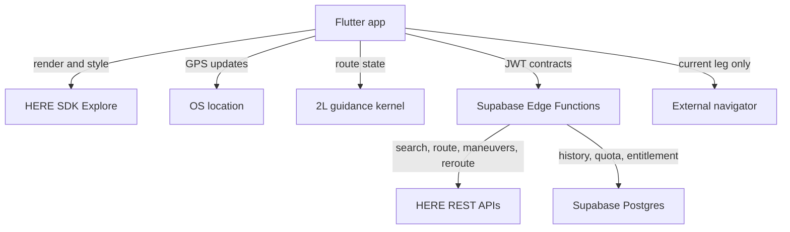

# 41 — HERE Explore Migration Program

> **Status:** Approved target; commercial eligibility and spike gated
> **Owner:** Product owner
> **Last reviewed:** 2026-08-18
> **Related:** [ADR-0030](adr/0030-here-platform-and-navigation-target.md) ·
> [ADR-0031](adr/0031-spike-before-flutter-migration.md) ·
> [Implementation Plan](36_IMPLEMENTATION_PLAN.md)

---

## 1. Purpose

This document controls the replacement of Google location services with HERE SDK Explore and HERE
online APIs, plus the creation of a deliberately limited 2L guidance engine. It distinguishes the
implemented system from the approved target, names capabilities that are not available without
HERE SDK Navigate, and orders the migration so that pricing headlines never substitute for
contract eligibility or measured usage.

It does not claim that HERE is configured, that the Base Plan permits the product's optimization
use case, or that free allowances have been verified. It does not redefine every current screen,
schema, or API payload; those owning documents change in later pull requests after their gates pass.

### Status vocabulary

- **Current** means present on `main` and expected to work today.
- **Target** means approved but not yet implemented.
- **Gate** means evidence required before the next irreversible step.
- **Cutover** means HERE serves production traffic and the corresponding Google dependency can be
  removed.
- **Essential guidance** means the bounded feature set in §2, not HERE Navigate parity.

## 2. Goals

1. Remove Google as the provider of address search, geocoding, route calculation, stop ordering,
   and map rendering.
2. Use HERE SDK Explore for a branded online map on Android and iOS through Flutter.
3. Build an app-owned, online guidance engine from operating-system location updates and HERE
   Routing API v8 route/maneuver data.
4. Keep a minimal external-navigation control for the **current leg only** throughout guidance.
5. Preserve Supabase as the system of record for authentication, entitlements, quotas, routes,
   favourites, and History.
6. Replace provider-owned identifiers in domain tables with internal UUIDs.
7. Make permitted use, transactions, safety, degraded states, and rollback measurable before
   migration.
8. Use disposable test data to reset the Google-shaped schema instead of building a production
   data migration.

### Essential guidance scope

The first production scope is:

- online position puck and bearing;
- follow/overview camera;
- active route and route-progress rendering;
- current and next maneuver;
- distance to maneuver, remaining distance, and ETA;
- staged visual and TTS maneuver announcements;
- conservative route projection with confidence state;
- sustained off-route detection and bounded rerouting;
- arrival detection and next-leg transition;
- pause/resume and version-safe session restoration;
- current-leg external navigator fallback.

**Non-goals**

- HERE SDK Navigate or any Navigate commercial agreement.
- Downloadable offline maps, offline search, offline routing, or offline guidance.
- HERE Positioning, HERE map matching, lane assistance, junction views, speed-limit warnings,
  road-sign warnings, tunnel extrapolation, spatial audio, or live truck warners.
- Calling this engine equivalent to a mature satellite navigator.
- Storing user History in HERE.
- Committing the proprietary Explore SDK package to this public repository.
- Hard-coding the reported 30,000/5,000 allowances before they are verified in the account and
  applicable pricing documents.
- Fleet dispatch, multiple vehicles, or a web control centre.

## 3. Responsibilities

| Concern | Owner | Notes |
|---|---|---|
| Account, Base Plan acceptance, payment controls | Product owner | Required to obtain credentials/package and verify exact allowance |
| Optimization-use eligibility | Product owner + legal/commercial confirmation | Base Plan flags Optimization; Tour Planning is the stated exception |
| Flutter/Explore integration | Engineering | Map renderer only; no Navigate APIs |
| Guidance kernel | Engineering | Pure Dart state machine and geometry, replay-tested |
| Location source | Android/iOS through a Flutter plugin | Must support foreground/background policy explicitly |
| Search/routing adapters | Supabase Edge Functions | Metered calls retain authorization, quota, caching, and usage events |
| History and entitlements | Supabase | Remains authoritative and provider-neutral |
| SDK package delivery | Engineering + product owner | Private artifact channel; never the public repository |
| Safety acceptance | Product owner + engineering | Simulation plus controlled physical-road testing |
| Visual acceptance | Product owner | Existing 2L colours plus approved navigation reference |

## 4. Target architecture

Boundary rules:

- The guidance kernel consumes provider-neutral `RoutePlan`, `RouteLeg`, `Maneuver`,
  `RouteHandle`, and `LocationSample` models; it imports no HERE SDK type.
- The Explore SDK is responsible for online map rendering, camera, style, markers, and polylines.
- Operating-system location is the source of device position because HERE Positioning is
  Navigate-only.
- Search, geocoding, route calculation, turn-by-turn actions, route handles, and reroutes are
  server-mediated so entitlement, quota, caching, cost, and kill switches remain enforceable.
- GPS updates never cause upstream calls one-for-one. Projection and progress are local; a HERE
  request occurs on plan, explicit recalculation, or sustained deviation only.
- A route saved to History is an immutable provider-neutral snapshot and remains readable without
  a HERE call.

## 5. Flows

### 5.1 Commercial and account validation

**Trigger:** this plan is accepted.  
**Preconditions:** none.

1. Create a HERE Base Plan account.
2. Register non-production Android and iOS applications.
3. Obtain Explore credentials and download the Flutter Explore package.
4. Confirm access to HERE Style Editor.
5. Read the account-specific pricing, RPS limits, transaction definitions, and restrictions.
6. Obtain written confirmation for the actual use cases:
   - one-driver stop-order optimization;
   - the permitted HERE product for that optimization;
   - route polylines and `turnByTurnActions` used by app-owned visual/TTS guidance;
   - route-handle rerouting during a live trip;
   - retention of search, coordinate, route, and maneuver data;
   - display of custom or independently computed overlays on the HERE map, if needed.
7. Record the exact free allowance and overage for map rendering, search/geocoding, Routing,
   Tour Planning or other approved optimization product, and rerouting.
8. Configure a hard spending ceiling/kill switch where the account permits it.
9. Put the pinned Explore archive in an approved private artifact channel.

**Success:** Gate A is green and engineering knows both what is allowed and what each event bills.  
**Failure:** stop before provider/runtime rewrite. Free quota without permitted use is not a pass.

### 5.2 Guidance-kernel spike

**Trigger:** Gate A passes.  
**Timebox:** seven engineering days.

1. Build a disposable Flutter shell with HERE SDK Explore on Android and iOS.
2. Load the first custom 2L style and render a fixture route.
3. Parse provider-neutral maneuvers derived from HERE `turnByTurnActions`.
4. Replay location traces for ideal and adversarial scenarios.
5. Implement projection, progress, maneuver scheduling, confidence, deviation, reroute, arrival,
   restoration, and current-leg fallback.
6. Prove Android/iOS foreground and background transitions.
7. Measure correctness, API transactions, battery, CPU, memory, cold start, map first frame, and
   binary size.
8. Set the feature decision in ADR-0031 from the evidence.

**Success:** Flutter + Explore + essential guidance proceeds to production slices.  
**Failure:** reduce in-app guidance or retain external driving. Do not imitate missing Navigate
capabilities until the demo appears green.

### 5.3 Provider and runtime cutover

1. Introduce provider-neutral domain contracts and schema.
2. Reset the test Supabase project.
3. Add HERE adapters behind search/routing facades and the approved optimization adapter.
4. Run contract, quota, billing, and retention tests against controlled non-production calls.
5. Build Flutter vertical slices: auth → route draft → search → optimize → map → History.
6. Promote the replay-tested guidance kernel as a separately reviewed slice.
7. Shadow-compare HERE results with the current provider on test routes without mixing
   provider-derived content in a user-visible production surface.
8. Run controlled physical-road guidance tests on Android, then iOS.
9. Cut test traffic to HERE behind independent map, API, optimization, and guidance flags.
10. Remove Google location secrets, functions, code, workflow inputs, and stale documentation only
    after rollback criteria remain green for one release candidate.
11. Keep Google OAuth until a separate authentication decision replaces it.

## 6. Architectural decisions

| ID | Decision | Applies to |
|---|---|---|
| [ADR-0030](adr/0030-here-platform-and-navigation-target.md) | Explore map + app-owned essential guidance; no Navigate | Map, route data, guidance, History |
| [ADR-0031](adr/0031-spike-before-flutter-migration.md) | Replay-tested guidance spike precedes Flutter rewrite | Mobile runtime and safety |
| [ADR-0006](adr/0006-mandatory-backend-proxy.md) | Server-metered provider calls remain proxied | HERE REST adapters |
| [ADR-0011](adr/0011-server-side-quota-enforcement.md) | Entitlement and quota stay server-owned | All upstream use |
| [ADR-0014](adr/0014-android-first-verification.md) | Android remains first, but iOS is an early spike gate | Device verification |

ADR-0004, ADR-0005, ADR-0007, ADR-0012, ADR-0021, ADR-0026, ADR-0027, and ADR-0028 describe the
current Google-era implementation. They are not rewritten retroactively. Later implementation PRs
mark them superseded where the new system actually replaces their decisions.

## 7. Edge cases

| # | Condition | Expected behaviour | Specified in |
|---|---|---|---|
| 1 | Base Plan does not permit 2L optimization | Stop; price Tour Planning/commercial access or evaluate a legally compatible independent stack | §5.1 |
| 2 | GPS matches two nearby/parallel route segments | Enter ambiguous state; do not advance or speak a maneuver until confidence recovers | guidance spike |
| 3 | GPS jumps briefly off route | Hysteresis absorbs it; no reroute request | guidance spike |
| 4 | Sustained deviation | One bounded reroute; cooldown prevents loops; external fallback remains | guidance spike |
| 5 | No network during a trip | Continue only with the already loaded route/maneuvers while map cache permits; show online degradation and no promise of reroute | guidance UX |
| 6 | App is killed mid-leg | Restore only the same route/leg/version; otherwise require safe recalculation | navigation state |
| 7 | Voice/TTS unavailable | Visual and haptic guidance continue with a visible voice state | guidance UX |
| 8 | Provider identifier changes | Internal location UUID remains stable; refresh provider reference | database PR |
| 9 | HERE quota/spend ceiling reached | Stop new upstream work, preserve saved routes, expose current-leg external fallback | backend PR |
| 10 | Test schema conflicts with target | Reset it; do not preserve disposable provider-shaped rows | database PR |
| 11 | Google OAuth remains enabled | Treat it as authentication only | ADR-0030 |
| 12 | Driver enters a tunnel or poor-GPS area | Freeze uncertain progress and communicate degraded guidance; never invent tunnel movement | guidance UX |

## 8. Error handling

| Failure | Detection | User-facing result | Retry | Fallback |
|---|---|---|---|---|
| HERE credential rejected | typed adapter error + health check | Service configuration unavailable | no blind retry | feature flag off |
| Optimization use/product not authorized | Gate A review | HERE migration unavailable | none | retain current app/evaluate approved provider |
| Search/routing quota exhausted | server quota decision | Explain limit and next action | at reset/entitlement change | saved data/current-leg external app |
| Explore SDK initialization fails | Flutter boundary error | Map unavailable; route list remains readable | one bounded restart | list + external current leg |
| Position confidence low | projection score and consistency | “GPS uncertain”; suppress maneuver advancement | continuous local recovery | external current leg |
| Sustained route deviation | distance + duration + heading gate | Rerouting state | one request + cooldown | remain degraded/external current leg |
| Reroute fails | typed server error | Guidance degraded, safe next action | bounded backoff only when stationary/allowed | external current leg |
| History sync fails | durable local outbox | Saved locally, sync pending | exponential backoff | local History |
| Voice unavailable | TTS capability/error | Voice off, visual guidance active | on capability change | visual/haptic |
| Route version mismatch | restoration validation | Cannot safely resume old guidance | explicit recalc | History snapshot/external leg |

## 9. Best practices

1. Model route following as a deterministic state machine over timestamped location samples; UI
   does not own navigation decisions.
2. Project locally onto a spatially indexed route polyline and track along-route distance rather
   than using straight-line distance to the next maneuver.
3. Require spatial, temporal, and heading evidence before progress/deviation changes; one GPS
   sample decides nothing.
4. Keep API calls event-driven and bounded. GPS frequency must not determine COGS.
5. Version every route, leg, maneuver list, and session. Stale geometry never resumes silently.
6. Keep the external current-leg button reachable in every degraded state.
7. Test recorded traces before road tests, then retain anonymized synthetic/consented fixtures
   rather than raw customer traces.
8. Treat the custom style as a legibility system: road hierarchy, maneuver contrast, labels,
   traffic, warnings, and dark mode outrank decorative similarity.
9. Pin the Explore SDK version and archive its notices, checksum, source, and license metadata in
   the private delivery channel.
10. Do not infer allowed use from technical capability or free transaction count.

## 10. Checklist and go/no-go gates

### Gate A — account, permitted use, and cost

- [ ] HERE Base Plan account created.
- [ ] Android and iOS applications registered.
- [ ] Explore credentials and Flutter package obtained.
- [ ] Private package delivery method documented.
- [ ] 2L stop-order optimization confirmed as permitted through a named HERE product/plan.
- [ ] Custom visual/TTS guidance from Routing v8 actions confirmed as permitted.
- [ ] Retention and map-overlay rights documented.
- [ ] Exact transaction definitions, free allowances, overages, RPS limits, and taxes recorded.
- [ ] Worst-case spend bounded with server quotas and a provider/account kill switch.
- [ ] The owner-supplied 30,000 map/geocode and approximately 5,000 routing figures either
      verified or replaced; they are not embedded as code constants before this box is checked.

### Gate B — guidance spike

- [ ] Exact Flutter and Explore versions pinned.
- [ ] Android and iOS map first frame proven.
- [ ] Custom style loads and remains legible in light/dark.
- [ ] Route/maneuver contract proven from real HERE fixture responses.
- [ ] Ideal and adversarial trace corpus committed without personal data.
- [ ] Projection, progress, maneuver timing, ambiguity, deviation, reroute, arrival, and restoration
      thresholds declared before evaluation.
- [ ] Voice, background transitions, and current-leg handoff proven on both platforms.
- [ ] False/late/missed maneuver and reroute-loop results recorded.
- [ ] Binary size, start time, map frame, CPU, memory, battery, and transaction usage recorded.
- [ ] No passing feature depends on a Navigate-exclusive API.

### Gate C — data/backend

- [ ] Provider-neutral schema approved.
- [ ] Test-data reset approved and rehearsed.
- [ ] HERE server adapters pass contract, quota, retention, and billing tests.
- [ ] Approved optimization adapter passes cost and quality tests.
- [ ] History is readable without a provider call.

### Gate D — release

- [ ] Android controlled physical-road acceptance complete.
- [ ] iOS controlled physical-road acceptance complete.
- [ ] Poor GPS, parallel roads, roundabouts, missed turns, background, voice loss, and no-network
      states tested.
- [ ] Safety wording accurately calls the feature essential guidance.
- [ ] Cost alarms and kill switches tested.
- [ ] Rollback rehearsal complete.
- [ ] Google location dependencies enumerated at zero.

## 11. Roadmap

| Wave | Scope | Exit condition |
|---|---|---|
| 0 | Documentation and decision pivot | Explore/custom-guidance plan accepted |
| 1 | Account, permitted use, quotas, private Explore delivery | Gate A |
| 2 | Flutter Explore + guidance-kernel spike | Gate B |
| 3 | Neutral schema/contracts and disposable DB reset | Gate C data portion |
| 4 | HERE search/geocoding/routing and approved optimization adapters | Contract, quota, legal, and cost tests |
| 5 | Flutter shell, auth, route planning, History | Current planner parity |
| 6 | Branded HERE map and visual system | Design/device acceptance |
| 7 | Essential in-app guidance | Replay and controlled-road matrix |
| 8 | Android then iOS release candidates | Gate D |
| 9 | Google location removal and documentation consolidation | One stable HERE release candidate |

Each wave continues on a new pull request from latest `main` after this documentation PR merges.
Provider, schema, runtime, and guidance changes are not combined into one merge.

## 12. Decision log

| Date | Change | Reason | Author |
|---|---|---|---|
| 2026-08-18 | HERE approved for APIs and map | Product requires a branded map and Google location exit | Product owner |
| 2026-08-18 | Navigate removed; Explore + owned essential guidance approved | Navigate is a separately contracted product; focused guidance should avoid that dependency | Product owner |
| 2026-08-18 | Flutter retained; spike redirected to guidance kernel | HERE supports Flutter Explore and the principal risk is now route following under imperfect GPS | Product owner |
| 2026-08-18 | Base Plan optimization eligibility made a hard gate | Base Plan restrictions identify Optimization as excluded except through Tour Planning | Architecture |
| 2026-08-18 | Supabase retained; test data may be reset | History, auth, quota, and entitlement remain product concerns | Product owner |
| 2026-08-18 | Google OAuth retained initially | Location and authentication migrations are independent risks | Product owner |

## 13. Rationale

Explore provides the part the product cannot reasonably recreate: a performant, customizable HERE
map on both platforms. Routing v8 provides geometry, turn-by-turn actions, road names, route
handles, and a documented rerouting flow. The focused product can own the UI and a conservative
route-progress state machine without paying for or claiming the full Navigate feature set.

That ownership is valuable only if the scope stays honest. Explore does not provide positioning,
road-network map matching, navigation events, warners, or offline maps. Essential guidance must
therefore prefer “uncertain—use fallback” over a confident wrong maneuver. The small external
current-leg control is a safety valve, not an embarrassing remnant.

The visual reference remains feasible as a direction: quiet light/desaturated 3D map, existing 2L
route colours, high-contrast active route, floating next-maneuver card, bottom distance/time
metrics, clear position marker, and minimal current-leg handoff. HERE Style Editor, camera control,
extruded buildings where available, and custom map items provide the mechanisms. License, available
Explore layers, legibility, and device performance define the final result.

The economic premise is not yet proven. Public pricing allowances describe volume, while Base Plan
restrictions define allowed use. A route optimizer can be technically under a free transaction
threshold and still be outside the plan. That is why account/legal confirmation precedes code.

## 14. Rejected alternatives

| Alternative | Attraction | Why rejected |
|---|---|---|
| HERE SDK Navigate | Complete supported guidance and offline | Separate commercial agreement/price; explicitly removed |
| Explore map with no in-app guidance | Lowest risk | Does not meet the approved focused experience |
| Full homemade Navigate parity | Maximum feature ownership | Unsafe and infeasible without map matching, attributes, offline stack, and mature warners |
| HERE calls directly from the client | Simple demo | Breaks quota, entitlement, cost control, and server kill switches |
| Assume 30k/5k allowances settle cost | Fast pricing decision | Exact figures and permitted use must be verified in the account |
| Use Routing/Waypoint Sequence for optimization without confirmation | Looks technically available | Base Plan restricts Optimization; named product authorization is required |
| Replace Supabase | Fewer vendors in name | HERE does not replace auth, History, entitlement, or relational state |
| Preserve current test records | Avoid reset | Adds migration complexity for data with no business value |
| Remove Google OAuth in the same cutover | Complete vendor removal | Expands account/recovery risk without helping location migration |

---

## Official evidence checked 2026-08-18

- [HERE SDK Flutter license comparison](https://docs.here.com/here-sdk/docs/flutter-introduction-editions)
- [HERE SDK Explore maps](https://docs.here.com/here-sdk/docs/flutter-maps)
- [HERE SDK map styling examples](https://docs.here.com/here-sdk/docs/flutter-examples)
- [HERE Routing API v8 turn-by-turn guidance data](https://docs.here.com/routing/docs/routing-v8-guidance)
- [HERE Routing API v8 route-handle rerouting](https://docs.here.com/routing/docs/routing-v8-adjust-route-after-deviation)
- [HERE Base Plan pricing entry point](https://www.here.com/get-started/pricing)
- [HERE Base Plan usage restrictions](https://www.here.com/get-started/pricing/base-plan-restrictions)
- [HERE excluded-use-case definitions](https://www.here.com/get-started/pricing/rps-limits-excluded-use-cases)

The public dynamic pricing page did not expose account-specific numeric rows to this review. The
reported 30,000 map/geocoding and approximately 5,000 routing allowances remain hypotheses until
the HERE account shows the applicable current values.
